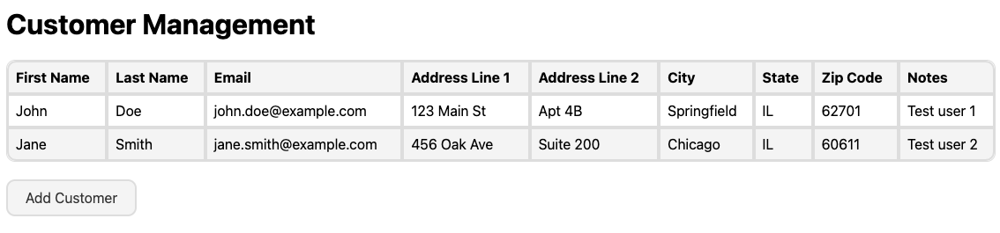
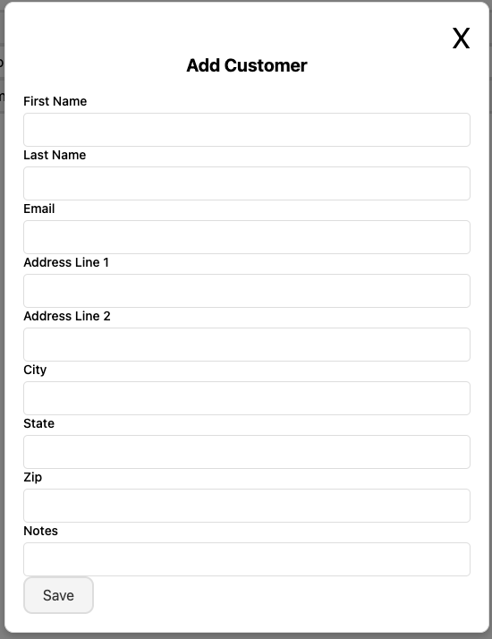

## Vistar Media QA Engineer Take-Home Project

### 🚧 DISCLAIMER - Work In Progress 🚧
It is important to note that at this point in time, while there is a portion of a working application that you should spin up locally, this is not yet completed.  This exercise was meant to be based on a theoretical application that is described below, and we are just getting to adding a working application to suppliment this exercise. That being said, to spin this up locally, you can run `npm install` from the root of the project to install the required dependencies, and then `npm run dev` to build and host the application locally. While the application isn't completely built out just yet, you will be able to view and interact with `data-testid` values for inputs and buttons, which may help you with writing your test cases. Currently, the user is able to add one or more customers, so this is the only test case that would actually run and pass against the application. Edit and delete UI and funcitonality have not been built out just yet, so any test cases you write outside of adding a new customer would be solely theoretical.

### The Application
Imagine you are testing a simple CRUD application that manages customers for a small business. The "Customers" page of this application simply allows the user to create, search, update and remove customer records. Imagine this page is a simple table that displays information about customers. There is an "Add Customer" button that when clicked, displays a modal where the user can input and save information for a new customer. The "New Customer" modal contains the following fields (fields marked with "*" are optional): 
* First Name
* Last Name
* Email
* Address Line 1
* Address Line 2 *
* City
* State
* Zip Code
* Notes *

To search for an existing customer, the user can input any information about the customer into a search field on the "Customers" page, which will filter resulting rows in the table. When the user selects a row in the table, a read-only modal called the "Customer Information" modal is displayed, which shows all of that customer's information.  To update an existing customer, you would select the "Edit" button within this modal. After editing any/all fields, the user would click the "Save" button to update the customer, which would dismiss the modal.

To delete a customer from the application, the user would select the "Remove Customer" button within the "Customer Information" modal. Upon selecting this button, a confirmation modal appears where the user selects the "Yes" button to permanently delete the customer from the system.  Your job as a QA Automation Engineer is to create UI tests that cover critical functional scenarios of this application's "Customers" page.

Below are a couple screenshots from this application, which is currently a work in progress as noted above:



### Task at Hand
* Create UI tests using TypeScript paired with Cypress for adding, editing, viewing, and removing customers from the application
* BONUS: create API tests for all/some of following endpoints:
  - `POST` to `/customers`
  - `GET` to `/customers`
  - `GET` to `/customers/{customerId}`
  - `PUT` to `/customers/{customerId}`
  - `DELETE` to `/customers/{customerId}`
 
If you choose to write some API test cases, you can assume that the `POST` request uses a request body with the following format:
```
{
  first_name: 'John',
  last_name: 'Appleseed',
  email: 'johnappleseed@vistarmedia.com',
  address_line_1: '400 Market St',
  address_line_2: 'Suite 825',
  city: 'Philadelphia',
  state: 'PA',
  zip_code: '19106',
  notes: 'This is a sample note.',
}
```

The `GET`, `PUT`, and `DELETE` requests contain response bodies with the same format, but also include `response.body.id` and `response.status`.

### Further Instructions and Specifications
* In order to setup this repository for local development, `cd` into the `tests` folder and run `npm install`. This should handle the installation of Cypress along with all required dependencies.
* Create and assume your own values for `data-test` attributes. For example, you could assume the `data-test` value for the "First Name" field is `[data-test="first-name"]`, and the `data-test` value for the "Save" button is `[data-test="save"]`
* You may spend as long as you wish on this project, but it is expected to take roughly 1-2 hours to complete this take-home project.
* You can implement anything you want! Dependencies, best practices, additional test cases, etc.
* Feel free to add additional test cases, even if they aren't completed, just to express testing scenarios that you are thinking about

### What We Are Evaluating
* Test organization and syntax
* QA best practices around test cases and function structure
* Critical thinking around test scenarios for front-end and API tests
